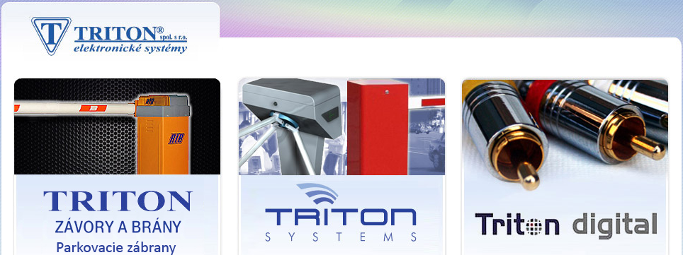
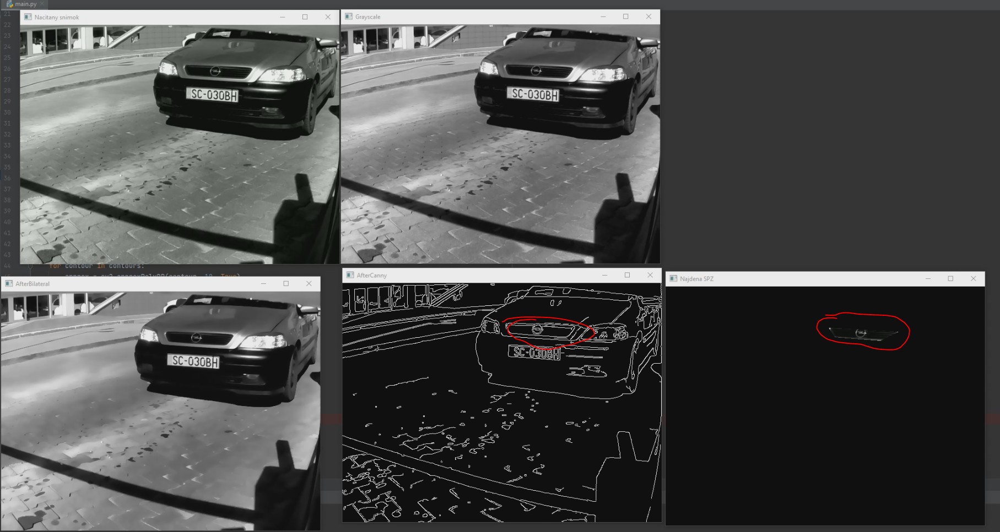
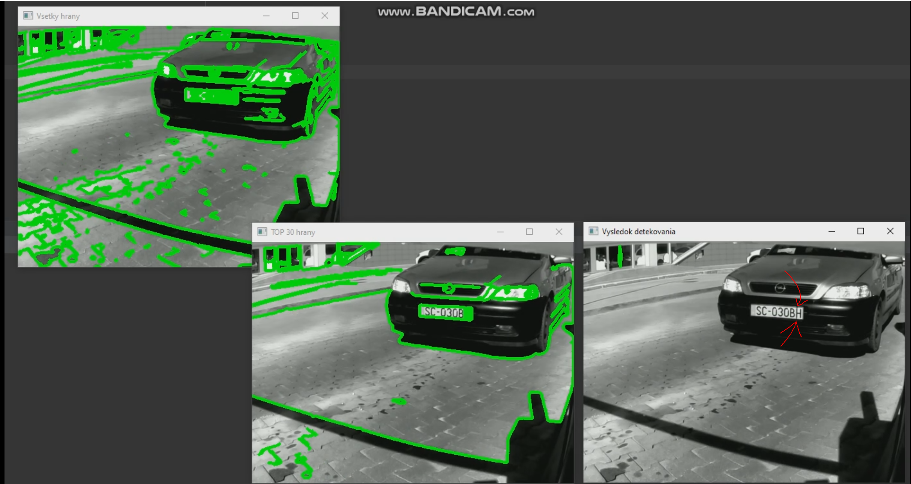
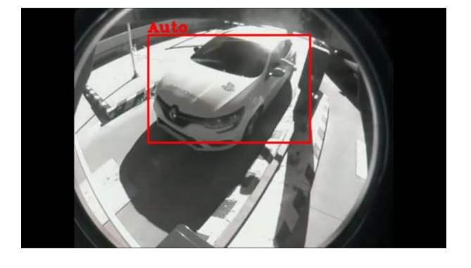
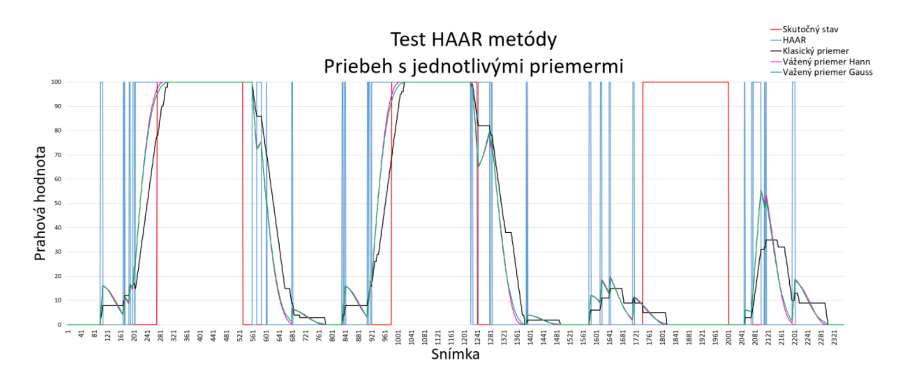
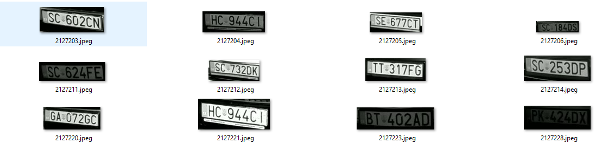
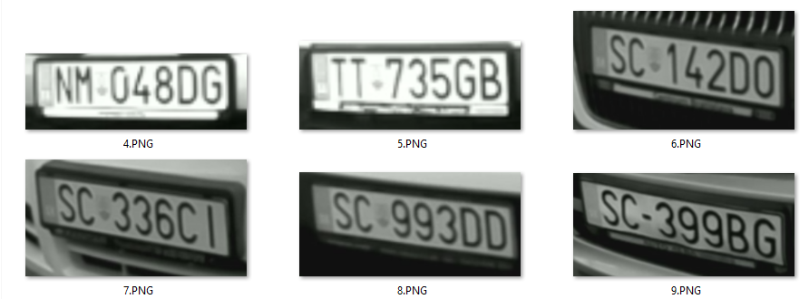
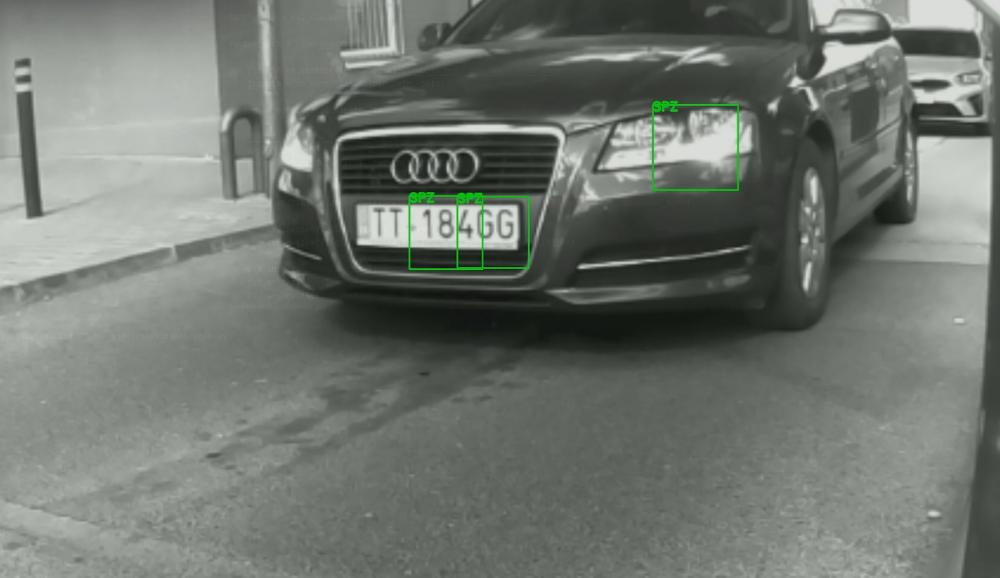
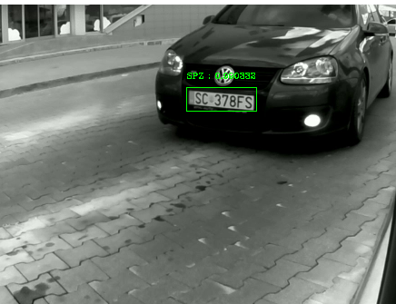
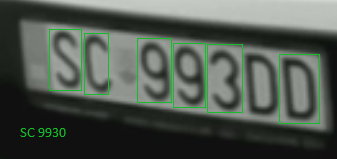

| **Project documentation**            |
| ------------------------------------ |
| Project for Triton - detect and reading license plate|
|                                      |
| **– TritonSystems –**                 |
|                 |

[1 Project management handbook](#project-management-handbook)

[1.1 Team](#team)

[1.2 Data exchange](#data-exchange)

[1.3 Project goal](#Project-goal)

[1.4 Analýza problému](#Analýza-problému)

[1.4.1 Aktuálne riešenie](#Aktuálne-riešenie)

[1.4.2 Iné komerčné riešenia](#Iné-komerčné-riešenia)

[1.4.3 Analýza nového riešenia](#Analýza-nového-riešenia)

[1.4.4 Detekcia miesta evidenčného čísla](#Detekcia-miesta-evidenčného-čísla)

[1.5 OCR](#OCR)

[2 Časť I - detekcia miesta spoznavácieho čísla](#Cast-I-detekcia-miesta-spoznavácieho-čísla)

[2.1 Detekcia pomocou spracovania obrazu](#Detekcia-pomocou-spracovania-obrazu)

[2.2Detekcia pomocou strojového učenia](#Detekcia-pomocou-strojového-učenia)

[2.3 Detekcia pomocou neurónových sietí](#Detekcia-pomocou-neuronových-sietí)

[3 Časť II čítanie obsahu](#Cast-II-čítanie-obsahu)

# Project management handbook 

## Team

<table>
<thead>
<tr class="header">
<th>Name</th>
<th>Role</th>
<th>Github nickname</th>
<th>Assigned WP (URDF)</th>
</tr>
  
</thead>
<tbody>
<tr class="odd">
<td>Boris Lupták</td>
<td>Supervisor</td>
<td>boris@tritonsystems.eu</td>
<td>...</td>

</tr>
<tr class="odd">
<td>Michal Škvarko</td>
<td>Member</td>
<td>michal.skvarko@tritonsystems.eu</td>
<td>...</td>

</tr>
</tbody>
</table>

## Data exchange

  - GoogleDrive
  - <https://drive.google.com/drive/folders/1l0onQGIotfxAmgDxWu9KgvOSWO7UyaPh?usp=sharing>

## Project goal

Plnohodnotný script pre detekciu a následné čítanie evidenčných čísel v čo najkratšom čase a bez vysokých hardvérových požiadavok. 

## Analýza problému

### Aktuálne riešenie
Aktuálne sa používa na detekciu zakúpený softvér. 
Softvér je blackbox.
Netuším či na detekciu sa používa neurónka alebo iný spôsob. (Zistiť či image sa posiela na ich server alebo parkoviska fungujú "offline")
Zvláštne je, že sof. sa musí updatovať pri novej okresnej triede evid. čísel.

### Iné komerčné riešenia
Pri hľadaní riešenia som narazil na niekoľko možných riešení bez vytvorenia vlastného scriptu. Vytvorenie cenového porovnania medzi 
prechodom na nový softvér s potrebným hardvérom vs ponúkané zdroje.
1. Kamera so softvérom na detekciu ktorá je kompletne pripravená na použitie: https://www.youtube.com/watch?v=if92sOFA2no
2. Softvér na detekciu - spoplatnená knižnica pre OpenCV https://www.openalpr.com/

### Analýza nového riešenia
Program bude pozostávať z dvoch krokoch.
1. Použitím vhodnej metódy sa alokuje miesto na ktorom sa nachádza evidenčné číslo
2. Pomocou vhodného OCR (Optical Character Recognition) prečítať evidenčné číslo

### Detekcia miesta evidenčného čísla
Detekcia miesta musí prebiehať v čo najkratšom čase
Táto metóda je najmenej náročná na hardvér, keďže požiadavka bola na to, aby sme sa vyhli drahému hardvéru (GPU < 2000)
1. Pomocou všeobecných operácií obrazového spracovania
2. Pomocou strojového učenia
3. Pomocou neurónových sietí

##### Detekcia pomocou operácií
Zložená s niekoľkých krokov v kombinácií rôznych filtrov a postupov
Cieľ je nájsť pomocou týchto funkcií hrany evidenčného čísla
Hlavné metódy je rozlišovanie bielych častí fotografie a hľadanie hrán pomocou detektorov

##### Detekcia pomocou strojového učenia
Na detekciu použijem strojové učenie. Konkrétne kaskádový príznakový algoritmus HAAR
Ten natrénujem na obdržaných fotografiách a následne otestujem
Túto metódu som použil počas akademického roka na detekciu vozidiel a bola najúspešnejšia 
spomedzi všetkých

##### Detekcia pomocou neurónových sietí
Porovnať dostupné neurónové modely a vybrať najvhodnejší na samotnú detekciu
Takáto detekcia je najpresnejšia ale aj zároveň viac náročná na výpočet a neviem predom povedať ako to ovplyvní chod v reálnom čase

### OCR
Pre čítanie evidenčných čísel použijem 2 rôzne metódy: EasyOCR, TesseractOCR, porovnáme a vyhodnotíme.
Čítanie bude pozostávať s niekoľkých krokov.
1. Všeobecné prečítanie všetkých znakov
2. Pokus o zatriedenie do štátu - roztriedenie podľa písmen
3. Kontrola existencie (kontrola podľa okresu - BA,KE,PO)
4. Kontrola správnosti - ak ide o SK značku (7 znakov začínajúca na písmeno) tak upraviť P0 na PO a iné korigovania

Zdroj informácií a prehľad európskych evidenčných čísel: 
http://worldlicenseplates.com/

## Cast I - detekcia miesta poznávacieho čísla
### Detekcia pomocou spracovania obrazu
K 1.9. som odskúšal niekoľko metód a kombinácií na takúto detekciu. 
Ukážky k niektorým z nich som doplnil sem nižšie a ešte doplním. Ide o jednouché scripty s pár krokmi.

Táto prvá metóda ma veľmi nízku úspešnosť. V priemere sme dosahovali úspech iba pri 1 z 3-4 snímok.

V metóde 2 som už použil filtre na hrany a odfiltroval menej výrazné a ponechal iba tie lepšie. Ale ako je vidieť na obrázku stačí aj páska cez značku a značka sa nedeteguje. Tak isto bude stačiť tieň, iný dopad slnka alebo kopec iných faktorov.

Ďalšie metódy sú veľmi podobné obsahujúce len iné kritéria výberu alebo rozšírenie o morfologické operácie.
Ukážky doplním čoskoro. Nie sú však oveľa lepšie.

### Detekcia pomocou strojového učenia
Túto metódu som vybral hlavne po veľkom úspechu v predchádzajúcej úlohe na detekciu vozidiel. 
Ako môžeme vidieť na obrázku nižšie, fungovala veľmi presvedčivo aj na novo natrénovaných snímkach s postihnutím rybieho oka.

Taktiež priebeh bol skoro totožný s realitou: Červená a modrá čiara na grafe - ostatné si nevšímať. Modrá sem tam vyskočí aj času ked je auto zastavené lebo 
detekuje ho aj počas príchodu. 

No pre detekovanie EČ sa ukázalo ako nevhodné.
Postup trénovania je v tom to prípade iný. Je potrebné vytvoriť snímky kde sú iba EČ. Tieto snímky je vhodné upraviť na jednotnú veľkosť. Následne vytvoriť druhú kategóriu fotiek kde sa objekt vôbec nenachádza. (použil som súkromné fotografie) Snažil som sa o trénovanie opakovane. Najprv to boli úplne všetky fotografie, následne som vyberal len tie kde bolo auto bližšie s lepšie viditeľnou ŠPZ a ani to nepomohlo. Ukážka datasetov je nižšie. 

Na obrázku nižšie je vidno ako veľmi zvláštne detegoval značku. To že je detegované svetlo je ešte v normále na koľko šlo o tréning len na niekoľko desiatok snímok ale to že delilo značku je divné. Ani raz nedetegoval celú značku, vždy iba jej časť. Ukážku niekoľkých snímok som nahral na video nižšie.

### Detekcia pomocou neuronových sietí
Zo všetkých doterajších výsledkov som si takmer istý že to bez tejto možnosti nepôjde. 

Záleží iba na našom výbere či bude potrebná GPU alebo stačí CPU. 

Podľa skúšok algoritmov sme schopný na CPU detegovať za sekundu 1-2 snímky na priemernom CPU. Na lepšom aj 5. 
Preto bude vhodné buď pre každé parkovisko vytvoriť vlastný hardvér alebo čo by možno stálo za úvahu 
prejsť na GPU s rýchlosťou 40-50 snímok za sekundu. Vytvoriť centrálny PC kam by sa posielali snímky z viacerých
parkovísk a následne sa vyhodnocovali. Neviem ako sú jednotlivé parkoviská pokryté internetom ale rozhodne si 
myslím že v Bratislave a vo väčších mestách kde máte viac parkovísk by táto metóda menej finančne náročná.

Pre predstavu mať procesor za 150 eur na nejakej doske (+niekoľko eur) pre 2-4 kamery alebo GPU za ~600 eur pre 60 kamery. Samozrejme neviem ako by to fungovalo v praxi 
pre odozvu medzi serverom a clientom ale v každom prípade by bolo vhodné vytvoriť si cenovú kalkuláciu a podľa toho to riešiť.

Všetko sú len odhady pretože ja taktiež častokrát používam google colab takže neviem tie časy povedať so 100% istotou. Najlepšie by bolo skúsiť vytvoriť potrebný hardvér a experimentovať priamo na ňom. Videl som niečo málo rozbehané na raspberry pi ale je to za každým veľmi individuálne a ani raz nevieme presne ako to bude v našom prípade nakoľko naše váhy sú iné a objekt menší (mám pocit že čím je hľadaný objekt menší tým je výpočtovo náročnejší)

Znova som porovnával niekoľko modelov ale v jazyku matlab. Rozhodol som sa nakoniec pre model YoloV4. Viem že existuje už aj verzia V5 ale tá ma ešte malú podporu a hlavne potrebuje veľmi špecifický hardvér. 
V4 podporuje nie len CPU ale aj GPU ak by sme teda prešli do tejto fázy. 
Na videu som znova nahral ukážku z mojej DP práce. CPU je AMD Ryzen 5 3600

A tu som to už experimentálne aj na evidenčné čísla. Nemám ešte ani zďaleka natrénované veľmi dobre váhy - to bude ešte chvíľu trvať ale predpokladám že toto bude najoptimálnejšie riešenie. Samotné trénovanie je najotravnejšia fáza celého procesu. 
Ostáva teda zhodnotiť hardvér ktorý bude k dispozícií a ktorý plánujete implementovať, respektíve ktorý sa už nachádza na parkovisku. 
Optimálne mi jeden takýto poskytnú aby som vedel otestovať či bude schopný rozbehať takúto detekciu. 

## Časť II čítanie obsahu

Tento týždeň som sa začal zaoberať porovnaním OCR metód na čítanie. 
Pre lepšiu výkonnosť by aj v tomto prípade bola potrebná GPU.
Moje predstavy sú zatiaľ také ako som popísal v úvode. Nie len samotné čítanie ale aj kontrola podľa vopred daných kritérií.
Napríklad aby som hneď opravoval najčastejšie chyby 0 na O a naopak ak vieme, že je to druhý znak slovenskej ŠPZ. 
Plánujem vytvoriť zoznam možných kombinácií aj pre rôzne krajiny respektíve aspoň slovenské takto vyriešiť. 
Používam zatiaľ iba vopred vystrihnuté snímky. 
Pravdepodobne znova použijem filtre na vyhladenie a morfologické operácie. 

Po prvotných načítaniach a skúškach sa ukázal easyOCR ľahšie implementovateľný ako teseractOCR. 

Prvá ukážka je nižšie na obrázku: 

6.9. 2021 Najbližších dňoch by som chcel dotiahnuť túto časť do finálnej podoby a následne odladiť detekčnú časť. Potom sa vrátim k dotrénovaniu váh, optimalizovaniu algoritmu a iné.